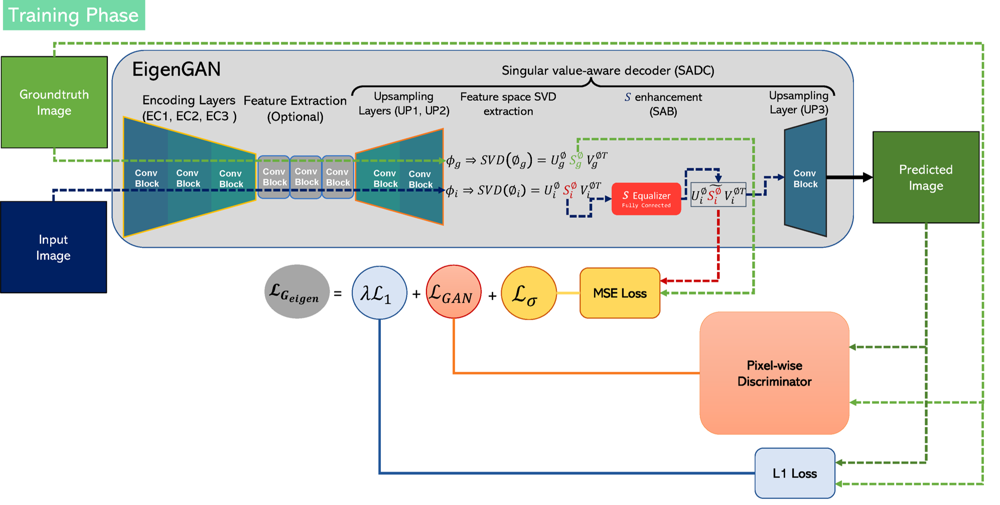
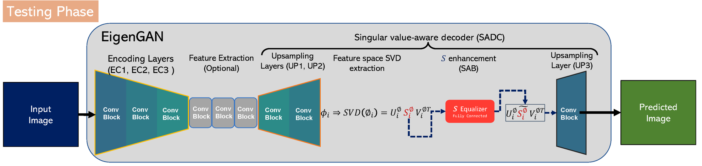
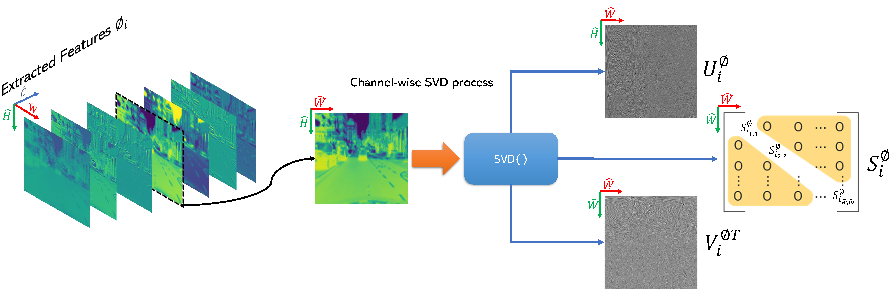

# Official PyTorch implementation of EigenGAN based on SVD subspace learning 
Mohamed Kas. Abderrazak Chahi. Ibrahim Kajo. Yassine Ruichek

Submitted to Knowledge-Based Systems

Paper link: (under review)

## Highlights 
<ul>
  <li> To the best of our knowledge, we are the first to integrate a subspace decomposition within a generator and during an adversarial framework as well. The subspace decomposition considered in this paper is SVD. </li>
  <li> The proposed SVD-based decoder is generic and can be integrated to all the auto-encoder architectures. In this work, we evaluated this integration on both ResNet and UNet generators that are widely used in GANs. </li>
  <li> The introduced subspace decomposition and learning are lightweight and do not drastically increase the number of parameters, which makes the learning process easier to converge. </li>
</ul>

## Abstract 
<p align="justify">
Generative adversarial networks (GANs) represent a significant advance in the field of deep learning for image generation problems. With their ability to generate highly realistic and diverse images, GANs are quickly becoming the preferred technique for a wide range of applications. However, GANs come with several limitations and challenges, chief among which are their collapse mode and instability during training. In this paper, we propose a novel generator GAN model that incorporates the singular value decomposition (SVD) process into the decoder module. The SVD integration allows the generator to recognize the underlying structures in the feature space, resulting in more robust and effective image generation. This is achieved by adjusting the singular values during the training process, effectively optimizing the SVD-based generator to produce images that match the ground truth. Another advantage of SVD integration is its ability to perform discriminative spatial decomposition that clearly reflects the differences between the generated features and the target features. By including SVD in the generator model, the resulting loss values are higher and less prone to gradient vanishing than conventional GANs, such as Pix2Pix. Our proposed SVD-based generator model can be integrated into any auto-encoder architecture, making it as a generic and versatile solution for various image-generation tasks. The effectiveness of the proposed SVD-based GAN in image generation has been validated in three challenging benchmarks for image restoration and visible-to-infrared image translation. Extensive experiments demonstrate the significant quantitative and qualitative improvements achieved by our SVD-based GAN compared to baseline GAN architectures. The overall system outperforms the current state of the art in all benchmarks tested.
</p>

# Framework 
<h3> Training Phase </h3>

<h3> Testing Phase </h3>

<h3> SVD process on features-level </h3>


# Code 
The code is based on pytorch-CycleGAN-and-pix2pix repo. We have implemented the proposed SVD-process as well as its related learning scheme. The SVD is computer using PyTorch library which makes it fully supported during the training phase by Autograd.
## Prerequisites
- Linux or Win64
- Python 3.7 or above
- NVIDIA GPU + CUDA CuDNN >=11.3
- PyToch 1.10 or above
### Installation
- Clone the repo using git or download it as a zip file:
```bash
git clone https://github.com/KasMohamed-tech/EigenGAN.git
cd EigenGAN/Code
```
- Install the required packages (PyTorch, Torchvision, PyTorch Cuda toolkit, OpenCV, Visdom, TensoBoard,...). We recommand to use the following Conda environnement depending on the OS:
  - Linux :
    ```bash
    conda env create -f environment_linux.yml
    ```
  - Win 64:
    ```bash
    conda env create -f environment_win64.yml
    ```
  - For pip users, please refer to requirements.txt file to install the packages using pip command :
    ```bash
      pip install -r requirements.txt
    ```
### Datasets 
This work targeted three applications that are : 
- Image Demoireing on <a href="https://huggingface.co/datasets/zxbsmk/TIP-2018/tree/main">TIP 2018</a>.
- Raindrop removal published in <a href="https://rui1996.github.io/raindrop/raindrop_removal.html">Attentive Generative Adversarial Network for Raindrop Removal from A Single Image</a>.
- Visible-infrared translation on on <a href="https://bupt-ai-cz.github.io/LLVIP/">LLVIP</a>.

The datasets should be downloaded and extracted to their respective folders in `datasets root`. Each dataset should have train and test folders. 
Your directory tree should be look like this:
```
$EigenGAN/Code/datasets
├── LLVIP
│   ├── train
│   └── test
├── TIP2018
│   ├── train
│   └── test
├── RainDrop
│   ├── train
│   └── test
```

### Training
The training parameters are shared between base_options.py and train_options.py. Most of them are set to the optimal values and some of them are included inline when running the training depending on the considered dataset, generator, discriminator, batch size, gpu ids, and experiment name.
- Before running the train script, we should run the visualizers on separate shells: 
  -  Visdom to view train images and losses :  run `python -m visdom.server` and click the URL http://localhost:8097.
  -  TensorBoard to view train images, losses, features, and weights distributions. please run `tensorboard --logdir ./runs/` and click the URL http://localhost:6006. It helps to compare different experiments and smooth the losses which is not possible with Visdom server in this implementation.
- Execute the training command ResNet based generator and Pixel-wise discriminator on LLVIP dataset using two GPUs (as an example):
  ```bash
    python train.py --dataroot datasets/LLVIP --model pix2pix --load_size 480 --crop_size 480 --gpu_ids 0,1 --netG resnet_9blocks --netD pixel --batch_size 8 --verbose --name LLVIP_resnet_pixel
  ```
  The options can be modified to train other combinations (U-Net generator, PatchGAN discriminator, load size, ....). The experiment name is used to store the checkpoints as well as during the visualizations on Visdom and TensorBoard.

### Testing 
To test a trained generator on a given task please run the following command using the training options that you considered: 
```bash
    python test.py --dataroot datasets/LLVIP --model pix2pix --load_size 480 --crop_size 480 --gpu_ids 0,1 --netG resnet_9blocks --batch_size 8 --verbose --name LLVIP_resnet_pixel --eval
  ```
To find the used parameters please check the config file located in `checkpoints/experiment_name/train_opt.txt`. 
The results will be saved in `results/experiment_name/`

#
This repo is still under development and many materials will be shared in the future (checkpoints, results, explanations, ....). 
Thank you for your understanding.
